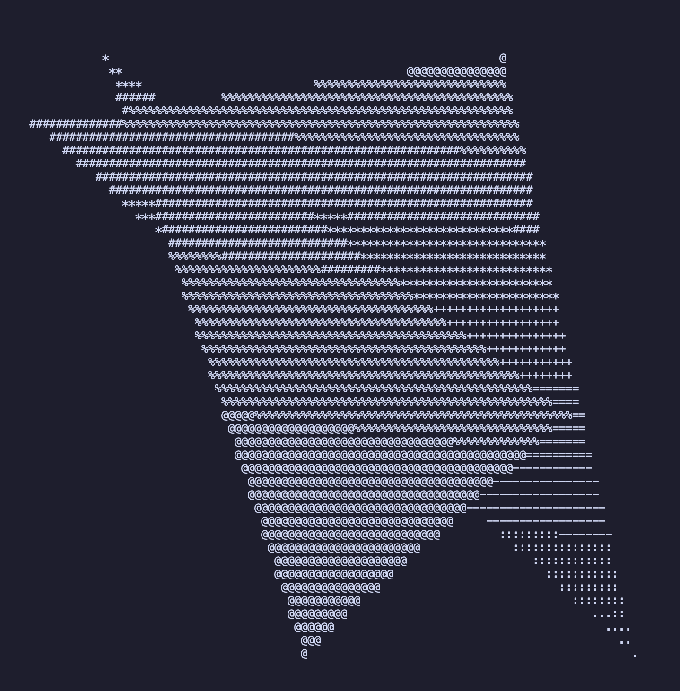

# rats - rasterize a triangle, silly
A simple ASCII-text software rasterizer library, written in Rust.



## Description

**rats** is a software rasterizer capable of rendering triangles as ASCII art to console output.

I decided to write a rasterizer to better understand how software rasterization worked, and spent an evening playing around with some quick C++ to test out a few ideas. **rats** is that experiment, rewritten in Rust, and designed to be more modular and reusable.

As opposed to a standalone application, I opted to write rats as a library instead, allowing external code to use it easily. Some example programs are included to demonstrate how the library can be used.

I chose to avoid trying to design a 'perfect' library that followed all of the Rust ecosystem's best practices or was the most performant or feature-rich. I opted for a codebase with zero dependencies and did my best to only include what was essential. I've tried to write fairly-performant code, but my priority was readability. Where possible, I've tried to write self-readable code, with occasional comments in more complicated sections.

The project directory structure is as follows:

```
|- \ src
|  |- lib.rs <- library
|  |- vertex.rs <- Vertex struct, ContainsPoint trait
|  |- line.rs <- Line struct
|  |- triangle.rs <- Triangle struct
|  |- bounds.rs <- Bounds struct, GetBounds trait
|  |- renderer.rs <- Renderer functionality
|  |- prelude.rs <- Frequently used library stuff
|
|- \ examples
|  |- demo.rs <- Draw two intersecting triangles
|  |- triangle.rs <- Draw a triangle
|  |- square.rs <- Draw a square
|  |- \ input_file
|     |- main.rs <- input_file entry point
|     |- serialize.rs <- Serialization
|     |- square.trianglelist <- Text file with a list of triangles to draw a square
|
|- README.md <- This file
|- LICENSE <- License file
|- demo.png <- Screenshot of program output
|- Cargo.toml <- Rust project description
```

I used Rust's examples folder feature to quickly write example programs that could use my library. These also helped direct my effort into adding additional functions to the library when I found myself rewriting the same code in several places.

The `Vertex` struct is shared by the `Triangle`, `Line` and `Bounds` structs. It is a three-component vector that has components of an aliased type, `VertexComponent`. This allows the underlying type to be switched out fairly easily, as most other parts of the library do not care what the actual type is, as long as it can be cast to the required types for calculations.

The `vertex` submodule also defines a trait, `ContainsPoint`, which has a function that returns whether the implementor contains a given `Vertex`.

The `Triangle` and `Line` structs simply contain three and two Vertices, respectively. They implement the `ContainsPoint` trait and specify whether a given point is 'inside' them.

The `Bounds` struct specifies a 3-dimensional volume. The addition operators have been overloaded such that the addition of two `Bounds` returns a `Bounds` that is a union of the two.

Finally, the `Renderer` holds and manages the data that is written out to the output. It holds an internal buffer of data that can be written to and cleared. Draw calls are made that overwrite this buffer. Finally, `render()` is called and the internal state is printed out to the standard output stream.

## Instructions

### Step 0: Install Rust *(if required)*

Install the [Rust toolchain](https://www.rust-lang.org/tools/install) to use `rustc` and `cargo`.

### Step 1: Run Examples

In a terminal, navigate to the project directory (where this README file is located) and run:

```sh
cargo run --example <example-name>
```

Where `<example-name>` is one of `triangle`, `demo`, `square`, or `input_file`.
